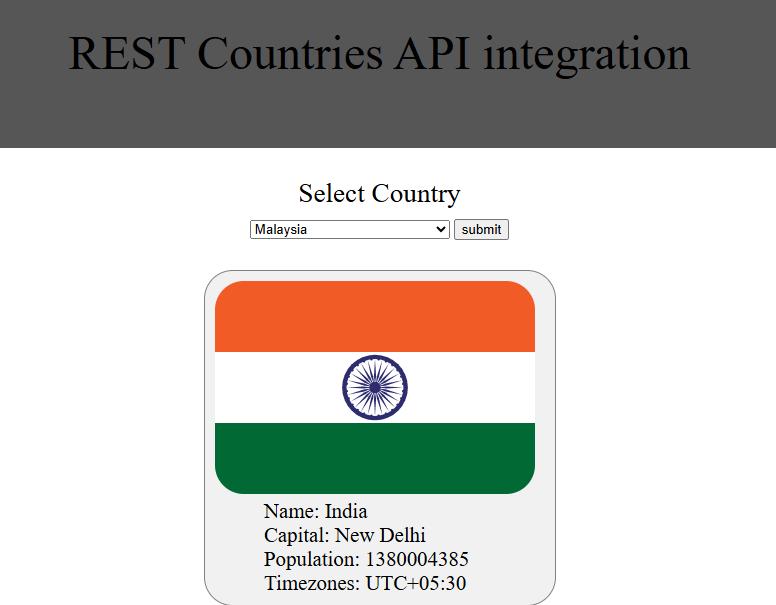

# REST COUNTRIES API INTEGRATION

## Overview
A simple web app that shows country information using the Rest countries API.

## Technologies Used
- Ejs
- HTML/CSS/JS

## Prerequisite
- Node.js
- npm

## How to run this file localy-
- Download this folder
- Navigate to the directory and type 'npm i' to install dependencies.
- Then 'nodemon index.js' to run the project.

